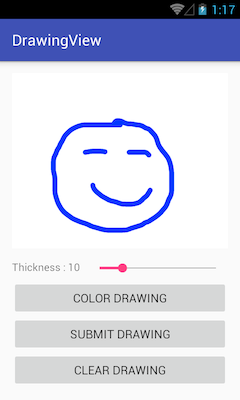
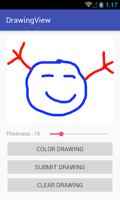
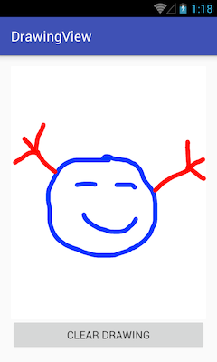

# DrawingView
Drawing in Android can be done without effort if you know how to handle a `Canvas` properly. However this requires some configuration to have even the simplest container the draw a line.

`DrawingView` was created to give you the basic container to draw anything you want. You can easily configure the color and thickness of what you are about to draw to finally extract the `Bitmap` you just created.





## Download

Gradle:

``
compile 'com.github.stephenvinouze:drawingview:1.0.0'
``

Maven:

```
<dependency>
  <groupId>com.github.stephenvinouze</groupId>
  <artifactId>drawingview</artifactId>
  <version>1.0.0</version>
  <type>aar</type>
</dependency>
```

Eclipse: [drawingview-1.0.0.aar](https://github.com/StephenVinouze/DrawingView/releases/download/1.0.0/drawingview-1.0.0.aar)

## Usage

```
<com.stephenvinouze.drawingview.DrawingView
            android:id="@+id/drawing_view"
            android:layout_width="match_parent"
            android:layout_height="match_parent"
            app:drawingColor="<your_color>"
            app:drawingThickness="<your_thickness>"/>
```

or programmatically :

```
DrawingView drawingView = new DrawingView(<your_context>);
drawingView.setDrawingColor(<your_color>);
drawingView.setDrawingThickness(<your_thickness>);
```

You can extract the `Bitmap` from the `DrawingView` at any moment :

```
Bitmap drawingBitmap = drawingView.getDrawing();
```

If you want to reset your drawing you can do it using :

```
drawingView.resetDrawing();
```

## License

```
Copyright 2015 Stephen Vinouze.

Licensed under the Apache License, Version 2.0 (the "License");
you may not use this file except in compliance with the License.
You may obtain a copy of the License at

   http://www.apache.org/licenses/LICENSE-2.0

Unless required by applicable law or agreed to in writing, software
distributed under the License is distributed on an "AS IS" BASIS,
WITHOUT WARRANTIES OR CONDITIONS OF ANY KIND, either express or implied.
See the License for the specific language governing permissions and
limitations under the License.
```
